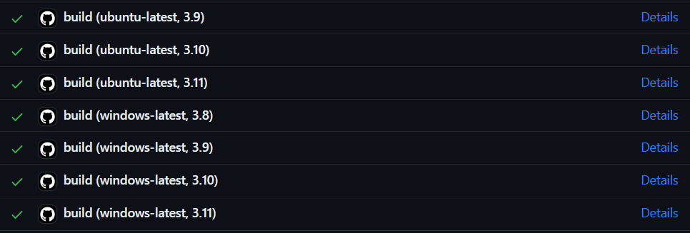

# Unit Testing

One very crucial state whenever building some code or package is to debug errors.
While there are many debugging methods, creating a unit test is very reliable for your current code and for any future changes.

The most known packages for unit tests are [`unittest`](https://docs.python.org/3/library/unittest.html) and [`pytest`](https://docs.pytest.org/en/latest/contents.html).
This document is based for `pytests`, although the first section will show you the differences among them.

**Content**
- [Pytest Vs Unittest](#pytest-vs-unittest)
- [Essentials](#essentials)
- [Pytest useful features](#pytest-useful-features)
- [GitHub integration](#github-integration)

## Pytest Vs Unittest

[`unittest`](https://docs.python.org/3/library/unittest.html) is a great package to understand unit test codes.
It is designed to organize everything within classes, with easy "set_up" and "tear_down" functions.
However, the decision of orienting the documentation on [`pytest`](https://docs.pytest.org/en/latest/contents.html) is because it is faster and allows easy multiple iterations for the same test (among many other characteristics).

As an example, let us suppose a python class named `Drawing`, which can draw squares and circles in blue and red colors. 

A `unittest` file for this example would be the following:

```python
import unittest
from drawing_pkg.drawing import Drawing


class TestDrawing(unittest.TestCase):
    def test_draw_square(self):
        """
        Test that a polygon with 4 sides is drawn
        """
        square = Drawing.draw_square()
        self.assertEqual(4, square.nof_sides)
        
    def test_colored_circle(self):
        """
        Test for checking the color argument works on the circles
        """
        circle = Drawing.draw_circle(color="blue")
        self.assertTrue(circle.is_blue)
        self.assertFalse(circle.is_red)

        circle = Drawing.draw_circle(color="red")
        self.assertTrue(circle.is_red)
        self.assertFalse(circle.is_blue)


if __name__ == "__main__":
    """ Code to run all tests within the file """
    unittest.main()
```

In this example, it is fairly clear what is being tested at every line. 
That is a very big advantage, but on the other side, it might be annoying to add many cases within the "test_colored_circle" method.

`pytest` allows to easily perform these tasks, at a faster rate too. Taking again only the "test_colored_circle" method, this should be the resulting code.

````python
import pytest
from drawing_pkg.drawing import Drawing

@pytest.mark.parametrize(
    "color, expected_blue",
    (
        ("red", "blue"),
        (False, True)
    )
)
def test_colored_circle(color, expected_blue):
    circle = Drawing.draw_circle(color=color)
    assert circle.is_blue is expected_blue
    assert circle.is_red is not expected_blue
````

This was a very small example, but `pytest.mark.parametrize` allows to set up values for different parameters in functions, meaning the current code will run twice:
1. color="red", expected_blue=False
2. color="blue", expected_blue=True

If instead of using once "parametrize" with all the arguments it would have been several (one for each argument), the total number of tests would have been the multiplication of the cases at each "parametrize".

## Essentials

Defining a good unit test, as mentioned previously, is an exceptional practice.
If done correctly, a unit test provides the following advantages (among others):
- Tests the correct usage of the tool.
- Checks that new code additions don't break the old behavior.
- Provides a simple example of using the tool.
- Allow testing multiple cases that were not taken in consideration when first defining the algorithm.

When we are decided to create a unit test, it is important also to keep a clean hierarchy.
As mentioned in the [project structure](package-development.md#project-structure) for Python packages, the unit test has to be outside from the package folder (as it is not directly part of it).

A good structure is creating a folder named `unittests`, which contains multiple test files named `test_{CLASS_NAME}.py`. Within each file, each test is defined as a function:
```python
"""
File 'unittests\test_drawing.py'
"""

def test_correct_drawings():
    """
    Test for checking each drawing is correctly initialized. The test will
    fail if any function raises an error or the number of sides is not correct.
    """
    ...

def test_colored_circle():
    """
    Test for checking all drawn circles are initialized with the correct color
    """
    ...
```

Each file might contain multiple tests.
It is recommended to **create multiple small test function** that one huge function testing everything.
Small tests help create simple code that is easy to check.

When defining a test function, the trick is to believe that all the other parts of the code work perfectly.
Thus, you only need to test one small part.
Because this is repeated (one test for each part), if any of those parts are broken, you would know.

To run all your tests, then you only need to run the following command:
```commandline
pytest unittests\
```

This command will run with the packages that you have installed, so don't forget to install your latest changes on the tool before running the tests.

## Pytest useful features

### Setup and teardown functions

`seutp` and `teardown` functions run at the beginning and at the end of every single test function.
Some instructions, life file deletion, should be contained here.
To use them, they have to be coded as specified.

````python
def setup_function():
   # Code here the instructions to be run before a test
   pass

def teardown_function():
   # Code here the instructions to be run after a test
   pass
````

[Documentation about setup/teardown](https://docs.pytest.org/en/6.2.x/xunit_setup.html#method-and-function-level-setup-teardown)

### Run the test multiple times

`pytest` allows to run a test multiple times with different inputs in a fairly easy use.
The decorator `pytest.mark.parametrize` has to be used for it, specifying the inputs to be iterated.

The final number of times the test is run will be the multiplication of all "parametrize" options:

````python
import pytest

@pytest.mark.parametrize(
    "color, expected_result",
    (("blue", "red"), (True, False))
)
def test_blue_color(color, expected_result):
    # This test will be run 2 times
    assert (color == "blue") is expected_result

@pytest.mark.parametrize("columns", range(3))
@pytest.mark.parametrize("rows", range(2))
def test_print_matrix(columns, rows):
    # This test will be run 6 times (3x2)
    string_matrix = ""
    index = 0
    for _ in rows:
        string_matrix += "\n"
        for _ in columns:
            string_matrix += f"{index} "
            index += 1
    print(string_matrix)
````

### Skipping tests
Sometimes skipping a test is needed. For it, `pytest` allows either skipping the whole test or only when a condition applies.

For example, if we are in the middle of the updating process of a package, a test might break.
If we want to run the other tests without worrying about this one failing, then it is needed to use the `pytest.mark.skip`

````python
import pytest

@pytest.mark.skip(reason="Current test does not work")
def test_decoding_file():
    ...
````

Another example is that we might want to run only certain cases at a test. For that, the `skipif` function will help.

````python
import pytest


@pytest.mark.parametrize("number", list(range(100)))
def test_even_numbers(number):
    # All odd numbers will be skipped
    pytest.mark.skipif(number % 2 != 0)
    ...
````

## GitHub integration

While testing your package locally is a splendid practice, it can only take you so far.
The best scenario for testing requires:
* Multiple python environments for checking backwards compatibility.
* Multiple OS environments for checking systems compatibility.
* As many random scenarios as possible to encounter problems you didn't think about at the start.

The first point can be done locally, although it is very inefficient to have multiple environments just for testing.
The second also can still be done if you don't mind having a virtual machine or a partition only for testing (although you have to be mad to do it).
The last is the easiest to do, but it also will take a lot of computational power to run the same test multiple times without much need.

Integrating your test in GitHub allows you to do all this simultaneously.
If any fails, you will see this on your branch status.
You can also set a badge which shows the satus (passing or failing) of your tests to the readme.

### GitHub actions setup

**First** you have to create, within the main project folder, a `.github` folder, containing a `workflows` folder.
These names cannot be modified.

```commandline
PROJECT
|-> src/
|-> Readme.md
| ...
|-> .github/
    |-> workflows/
```

Within `.github/workflows/` you can create all .yml configuration files for the actions.
You can look at a template for running tests within [`helpful_files/gh_actions_test.yml`](../helpful_files/gh_actions_tests.yml).

### Understanding the action files

Taking as an example of the previous named file, let's see step by step what the file contains:

```yaml
name: Tests
```

This is the name to be displayed at both the GitHub jobs and the final badge.

```yaml
on:
  push:
    branches: ["*"]
  pull_request:
    branches: ["master", "develop"]
```

This means that the actions will be performed for:
- All pushes into any branch
- All pull requests open to be merged into "master" or "develop"

Consider which scenarios are the ones that you actually want to have your actions run.
Maybe you don't need them to run at every single push at all the branches, or maybe you don't require them to run within the pull requests.

```yaml
jobs:
  build:
    ...
```

This section is where the magic happens.
Here are named all jobs to be run as GitHub actions.
In this case, there is only one named 'build'.
Feel free to add as many jobs and name them as you desire.
As an alternative, you can always add different .yml files if you feel insecure of adding other jobs.

```yaml
jobs:
  build:
    
    runs-on: ${{ matrix.os }}
    strategy:
      matrix:
        os: [ubuntu-latest, windows-latest]
        python-version: ["3.8", "3.9", "3.10", "3.11"]
        
    ...
```

**runs-on** specifies the operating system that will be taken for the jobs. This is usually `ubuntu-latest`  or `windows-latest`.

**strategy** sets the strategy to follow to create multiple environments. 
In this case, a matrix of multiple OS and python versions is being defined.

As a result, 8 different virtual environments will be created: 4 for Ubuntu and 4 for Windows.
All of then will be running in parallel.

```yaml
jobs:
  build:
    
    runs-on: 
      ...

    steps:
      - uses: actions/checkout@v3
      - name: Set up Python ${{ matrix.python-version }}
        uses: actions/setup-python@v4
        with:
          python-version: ${{ matrix.python-version }}
    
      - name: Install dependencies
        run: |
          python -m pip install --upgrade pip
          pip install pytest .
      - name: Run unittests
        run: pytest unittests
```

The last part is `steps`, where all the steps to run are defined.
Each step is defined by `-` to create a list of steps:
- The first step checks out the current branch
- The second, creates the python environment defined by the matrix state
- The third installs pytest and '.' (current directory)
- At last, pytest is run over the folder 'unittests'

That will set all your actions. Then, when you push your changes, you will have a detailed description of all the jobs run:



Have in mind this is a very basic usage of the actions.
You can find the official documentation here:<br>
https://docs.github.com/en/actions

### Showing your badge

Once you have all set, you might want to have your shiny badge to show everyone that your code is running as expected.

As an example, I have a package named [PyMathTools](https://github.com/Jtachan/PyMathTools), which shows this badge:
<br>

The GitHub actions already give you this badge, without the need of you doing any extra work.
To add it, you just need to add an image with the following hyperlink:

`https://github.com/[GH-USER]/[REPO-NAME]/actions/workflows/[ACTIONS-FILE-NAME].yml/badge.svg`

That should set everything you require.
